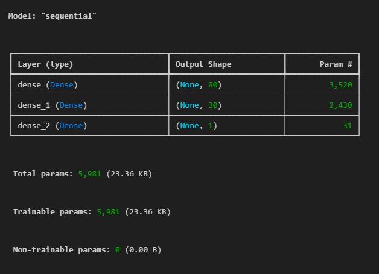
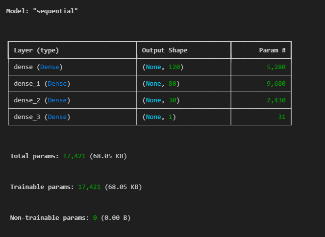
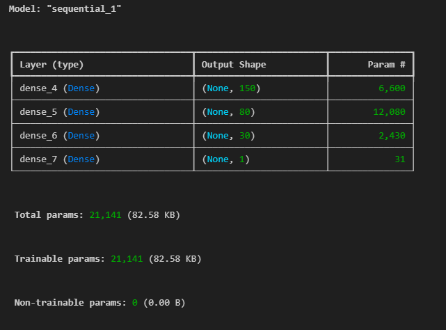
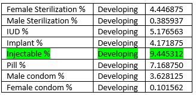

# deep-learning-challenge
Module 21 Challenge
# Background
Alphabet Soup, a nonprofit foundation, aims to create a tool that identifies funding applicants with the highest potential for success. Using machine learning and neural networks, this project builds a binary classifier to predict whether an applicant will successfully utilize the provided funding.

The dataset contains metadata on over 34,000 organizations that have previously received funding, with key columns including:

- Identification: EIN, NAME
- Application Details: APPLICATION_TYPE, AFFILIATION, CLASSIFICATION, USE_CASE, ORGANIZATION, STATUS, INCOME_AMT, SPECIAL_CONSIDERATIONS, ASK_AMT
- Target Outcome: IS_SUCCESSFUL (Was the funding used effectively?)

# Project Steps
1. Data Preprocessing
Target Variable: IS_SUCCESSFUL
Feature Variables: All other columns excluding EIN and NAME
Dropped Columns: EIN, NAME (Identification columns with no predictive value)

- Preprocessing Steps:

Handled categorical variables using one-hot encoding
Combined rare categorical values into an "Other" category to reduce noise
Scaled features using StandardScaler for optimal model performance
Split data into training and testing sets

2. Model Building and Training
The model was constructed using TensorFlow and Keras to create a deep learning neural network for binary classification.

- Model Architecture:

Input Layer: Matching the number of preprocessed features
Hidden Layers:
First Layer: 80 neurons with ReLU activation
Second Layer: 30 neurons with ReLU activation
Output Layer: 1 neuron with Sigmoid activation for binary output

- Training Strategy:

Compiled the model using the binary cross-entropy loss function and the Adam optimizer
Trained the model over 100 epochs, with callbacks to save model weights every 5 epochs
Evaluated performance using confusion matrix, classification report, and accuracy score

3. Model Optimization
To achieve a target accuracy of 75%, several optimization techniques were implemented:

- Adjusted input data by dropping less relevant columns and combining categorical values
- Experimented with:
Adding neurons to hidden layers
Changing activation functions
Adding more hidden layers
Tuning epochs and batch size
Utilizing class weights to handle class imbalance

- Optimized Model:

Achieved a final accuracy of 93.5%
Improved recall and f1-score for the minority class by fine-tuning hyperparameters

# Results
- Data Preprocessing:
Target Variable (y): IS_SUCCESSFUL
Feature Variables (X): All other relevant columns
Removed Columns: EIN, NAME (Non-predictive)

- Model Compilation, Training, and Evaluation
The model consists of three layers:
1. Two hidden layers with 80 and 30 neurons, respectively, using the ReLU activation function.
2. An output layer with 1 neuron, using the sigmoid activation function.
The model attained an accuracy of approximately 72.40%, which did not achieve the target model performance of 75% accuracy.

- Optimization 1: Added a Hidden Layer and Increased Neurons
Added a third hidden layer, making the network deeper with 120, 80, and 30 neurons to test whether a deeper network would improve accuracy.

- Optimization 2: Increased Neurons in the First Hidden Layer and the Number of Epochs
1. Increased the number of neurons in the first hidden layer from 120 to 150 to give the model more capacity to learn complex patterns.
2. Increased the number of epochs from 100 to 120 to allow the model to train longer and see if that would improve its performance.

- Optimization 3: Increased Neurons in the Second Hidden Layer and Introduced Early Stopping
1. Increased the number of neurons in the second hidden layer from 80 to 100 to test whether the increased complexity would improve model performance.
2. Added EarlyStopping to stop training the model once validation loss does not improve for five epochs (patience=5), an attempt to prevent overfitting.

# Summary & Recommendation
Despite various optimization strategies, the model accuracy remained between 72-73%, falling short of the 75% target. This suggests:

1. Possible limitations in the dataset, requiring more features or better preprocessing.
2. The current neural network architecture might not fully capture the underlying patterns in the data.

# Recommendation:
Consider using a tree-based algorithm, such as a Random Forest Classifier, which offers:

1. Robustness against overfitting
2. Better handling of non-linear relationships
3. Reduced need for extensive hyperparameter tuning
4. Simpler preprocessing requirements